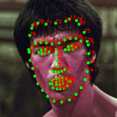
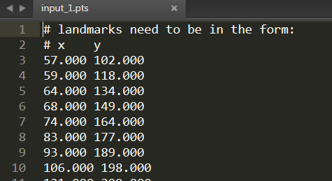

# face_landmarks81
## Reference Project: 
https://github.com/codeniko/shape_predictor_81_face_landmarks 
## Overview: 
Generating a image with 81 identified face landmarks from a input image, and save 81 points. 
## Prerequisites: environment
* Python2.7
* opencv-python 3.1.0.5
* dlib 18.17.100
## Run it
1. Run 'face_landmarks81.py' 
2. Select a image 
3. Save image with 81 points and 81 points. 
## Example

